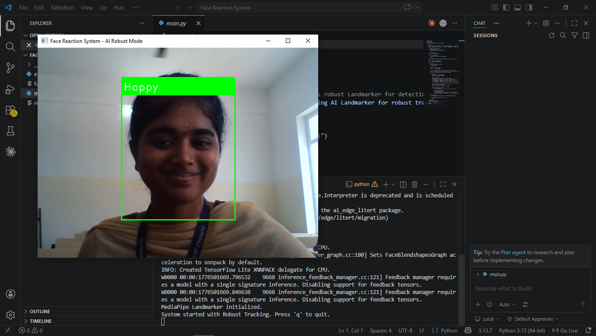

# Face Reaction System

A real-time facial emotion recognition system that detects faces and analyzes emotional reactions using advanced AI technologies. This system leverages MediaPipe's robust face landmarking and the FER library for emotion detection, providing accurate and responsive feedback on user reactions.

## Features

- **Real-time Face Detection**: Utilizes MediaPipe Face Landmarker for robust face tracking, resistant to head rotations and slants.
- **Emotion Recognition**: Employs the FER (Facial Expression Recognition) library to identify primary emotions.
- **Custom Reaction Logic**: Enhances emotion detection with custom algorithms for reactions like "Sleepy" (based on eye aspect ratio) and "Active".
- **Visual Feedback**: Displays detected reactions with color-coded bounding boxes on the video feed.
- **Webcam Integration**: Seamlessly captures and processes video from the default webcam.
- **Cross-platform Compatibility**: Runs on Windows, macOS, and Linux with Python support.

## Installation

### Prerequisites

- Python 3.7 or higher
- Webcam access

### Steps

1. Clone the repository:
   ```bash
   git clone https://github.com/yourusername/face-reaction-system.git
   cd face-reaction-system
   ```

2. Install the required dependencies:
   ```bash
   pip install -r requirements.txt
   ```

3. Download the MediaPipe face landmarker model:
   - The `face_landmarker.task` file should be included in the repository. If not, download it from the [MediaPipe documentation](https://developers.google.com/mediapipe/solutions/vision/face_landmarker).

## Usage

1. Ensure your webcam is connected and accessible.

2. Run the main script:
   ```bash
   python main.py
   ```

3. The system will initialize and start capturing video from your webcam.

4. Detected faces will be highlighted with bounding boxes, and the corresponding reaction will be displayed.

5. Press 'q' to quit the application.

## Output

Here's an example of the system's output displaying detected reactions:



- **Happy**: Green bounding box
- **Sad/Cry**: Blue bounding box
- **Angry**: Red bounding box
- **Sleepy**: Yellow bounding box
- **Surprise/Fear**: Cyan bounding box
- **Active**: Green bounding box (for neutral with open eyes)
- **Neutral**: Default color

## Requirements

- opencv-python
- mediapipe
- fer
- tensorflow
- tf-keras
- numpy

## Architecture

The system consists of two main components:

- **EmotionEngine** (`emotion_engine.py`): Handles face detection, emotion analysis, and reaction refinement using MediaPipe and FER.
- **Main Application** (`main.py`): Manages webcam input, processes frames, and displays results using OpenCV.

## Contributing

Contributions are welcome! Please feel free to submit a Pull Request.

## License

This project is licensed under the MIT License - see the [LICENSE](LICENSE) file for details.

## Acknowledgments

- [MediaPipe](https://mediapipe.dev/) for face landmarking
- [FER](https://github.com/justinshenk/fer) for emotion recognition
- OpenCV for computer vision utilities</content>
<parameter name="filePath">c:\Users\user\DATA SCIENCE\Deep Learning\Face Reaction System\README.md
